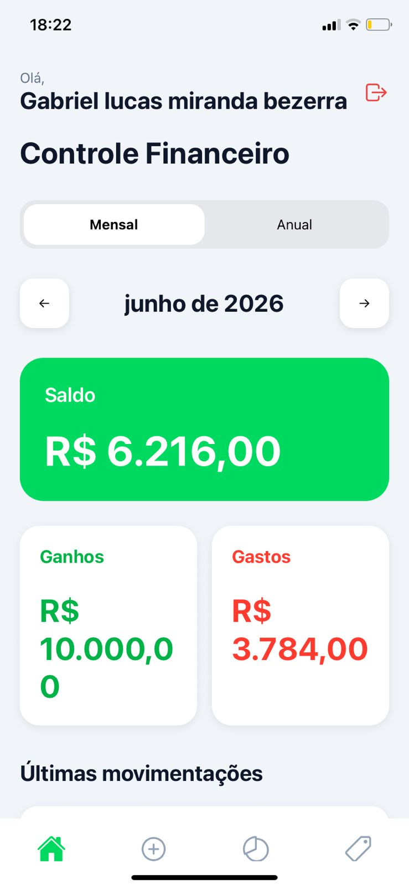
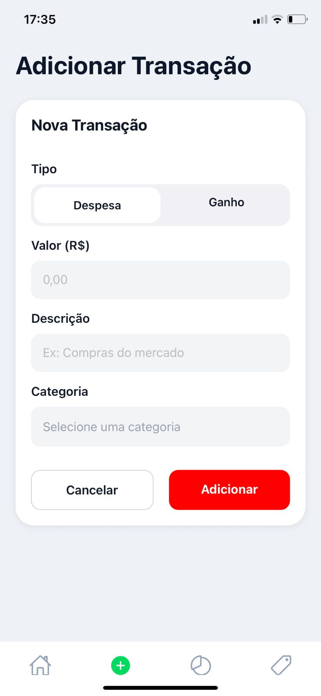
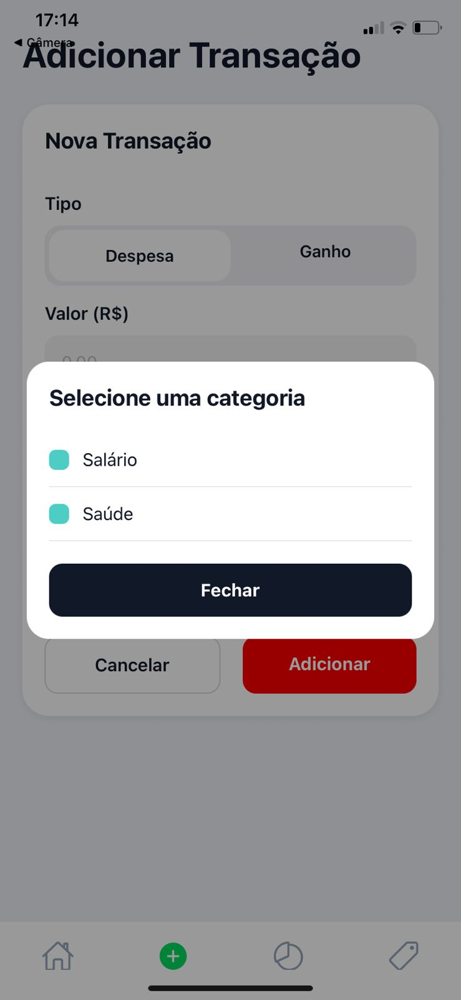
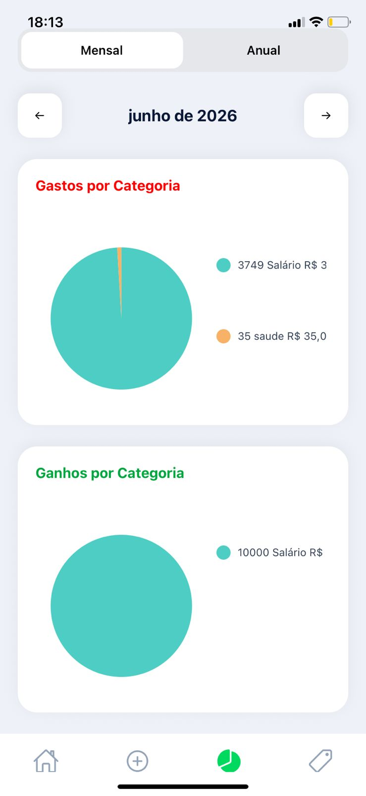
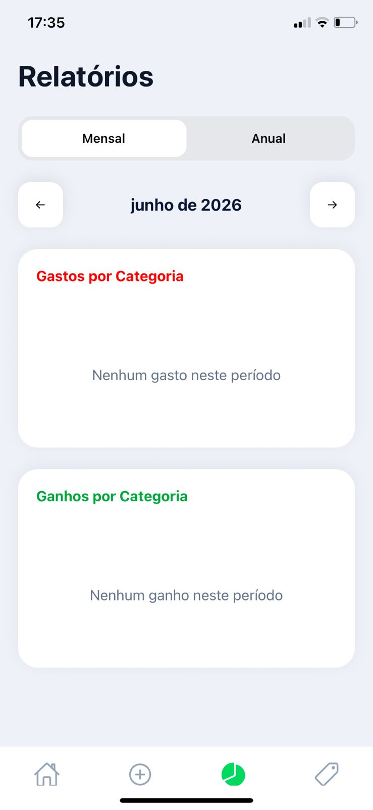

# 💰 FinTrack

Aplicativo mobile de gestão financeira pessoal desenvolvido com **React Native** e **Expo**, com foco no controle de receitas, despesas e acompanhamento da saúde financeira do usuário.

> ⚠️ **Status do Projeto:** Em desenvolvimento.
>
> Novas funcionalidades estão sendo implementadas continuamente e algumas telas e recursos ainda podem sofrer alterações.

---

## 📱 Sobre o Projeto

O FinTrack foi criado com o objetivo de ajudar usuários a organizarem suas finanças pessoais de forma simples e intuitiva.

A aplicação permite registrar movimentações financeiras, visualizar informações organizadas e acompanhar o fluxo financeiro diretamente pelo celular.

Além de ser um projeto acadêmico e de portfólio, o FinTrack também serve como ambiente de aprendizado para práticas modernas de desenvolvimento mobile utilizando React Native.

---

## 🚀 Funcionalidades

### Implementadas

- Cadastro de receitas
- Cadastro de despesas
- Listagem de movimentações financeiras
- Persistência local de dados
- Interface mobile responsiva
- Navegação entre telas

### Em desenvolvimento

- Dashboard financeiro
- Gráficos de gastos e receitas
- Filtros por período
- Categorias personalizadas
- Exportação de dados
- Backup de informações
- Relatórios financeiros

---

## 🛠️ Tecnologias Utilizadas

### Front-end Mobile

- React Native
- Expo
- JavaScript
- TypeScript

### Banco de Dados

- SQLite
- Expo SQLite

### Gerenciamento

- Zustand

### Navegação

- React Navigation

### Ferramentas

- Git
- GitHub
- VS Code

---

## 📂 Estrutura do Projeto

```bash
FinTrack/
│
├── src/
│   ├── components/
│   ├── screens/
│   ├── store/
│   ├── services/
│   ├── database/
│   └── styles/
│
├── assets/
│
├── App.js
├── package.json
└── README.md
```

---

## ⚙️ Pré-requisitos

Antes de executar o projeto, certifique-se de possuir instalado:

### Node.js

Recomendado:

- Node.js 18 ou superior

Verificar versão:

```bash
node -v
```

### npm

Verificar versão:

```bash
npm -v
```

### Git

Verificar versão:

```bash
git --version
```

### Expo Go (para testes no celular)

Android:

https://play.google.com/store/apps/details?id=host.exp.exponent

iOS:

https://apps.apple.com/app/expo-go/id982107779

---

# ▶️ Como Executar o Projeto

## 1. Clonar o Repositório

```bash
git clone https://github.com/m-anchieta/FinTrack.git
```

---

## 2. Entrar na Pasta do Projeto

```bash
cd FinTrack
```

---

## 3. Instalar as Dependências

Execute:

```bash
npm install
```

Esse comando irá baixar todas as bibliotecas necessárias para o funcionamento da aplicação.

---

## 4. Iniciar o Projeto

Execute:

```bash
npm start
```

ou

```bash
npx expo start
```

Após a inicialização, o Expo abrirá uma interface no navegador contendo um QR Code.

---

## 5. Executar no Celular

### Android

1. Instale o aplicativo Expo Go.
2. Abra o Expo Go.
3. Escaneie o QR Code exibido no terminal ou navegador.

### iPhone (iOS)

1. Instale o Expo Go.
2. Abra o aplicativo.
3. Escaneie o QR Code utilizando a câmera do aparelho.

---

## 6. Executar no Emulador Android

Com o Android Studio instalado:

```bash
npx expo start
```

Depois pressione:

```bash
a
```

para abrir o aplicativo automaticamente no emulador Android.

---

## 7. Executar no Simulador iOS

MacOS:

```bash
npx expo start
```

Depois pressione:

```bash
i
```

para abrir o simulador iOS.

---

## 💾 Banco de Dados

Atualmente o projeto utiliza armazenamento local através do SQLite.

As informações cadastradas permanecem salvas localmente no dispositivo mesmo após o fechamento da aplicação.

---

## 🎯 Objetivos do Projeto

Este projeto tem como objetivos:

- Aprimorar conhecimentos em React Native
- Praticar gerenciamento de estado
- Trabalhar com persistência local de dados
- Aplicar conceitos de arquitetura de software
- Construir uma aplicação real para portfólio profissional

---

## 📸 Screenshots

<p align="center">
  
  
  
</p>

<p align="center">
  
  
</p>

<p align="center">
  <em>Telas do aplicativo FinTrack.</em>
</p>

---

## 🔄 Roadmap

- [x] Estrutura inicial do projeto
- [x] Cadastro de movimentações
- [x] Persistência local com SQLite
- [ ] Dashboard financeiro
- [ ] Gráficos
- [ ] Categorias
- [ ] Relatórios
- [ ] Exportação de dados
- [ ] Backup em nuvem

---

## 🤝 Contribuições

Sugestões, melhorias e feedbacks são sempre bem-vindos.

Caso queira contribuir:

1. Faça um Fork do projeto
2. Crie uma branch para sua feature

```bash
git checkout -b minha-feature
```

3. Faça commit das alterações

```bash
git commit -m "Minha nova feature"
```

4. Envie para o GitHub

```bash
git push origin minha-feature
```

5. Abra um Pull Request

---

## 👥 Equipe do Projeto

O FinTrack foi desenvolvido em colaboração por dois integrantes, com responsabilidades divididas entre desenvolvimento de interface e arquitetura de dados.

### Mateus Anchieta

Responsável pela arquitetura de persistência local de dados, integração com SQLite, modelagem e gerenciamento das informações da aplicação.

GitHub: https://github.com/m-anchieta

---

### Gabriel Bezerra

Responsável pela estrutura inicial do projeto, desenvolvimento do front-end, criação das telas e experiência do usuário da aplicação.

GitHub: https://github.com/bezerragb


---

## 📌 Observação

Este projeto encontra-se em desenvolvimento ativo e novas funcionalidades serão adicionadas conforme sua evolução.
